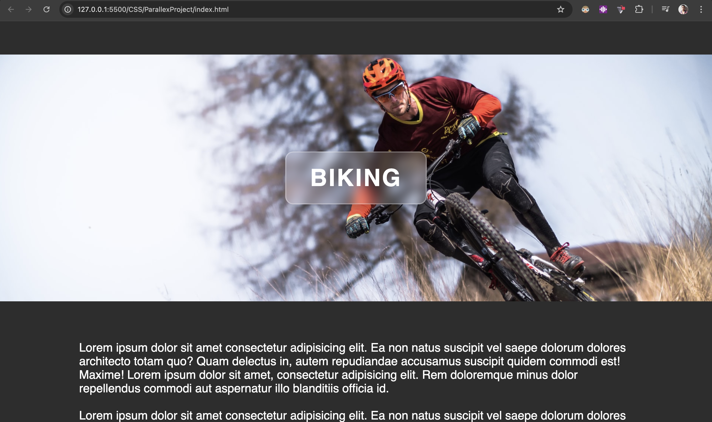

# 🌌 Parallax Project

A simple parallax scrolling website built using **HTML & CSS**.  
This project demonstrates how to create depth and 3D-like scrolling effects using background images.

---

## 🚀 Features
- Smooth parallax scrolling effect
- Fully responsive design
- Clean and minimal CSS
- Beginner-friendly structure

---

## 📸 Screenshots

### Homepage

### Scrolling Effect

---

## 🛠️ Tech Stack
- **HTML5**
- **CSS3 (Flexbox, Positioning, Parallax)**

---

## 📂 Folder Structure
